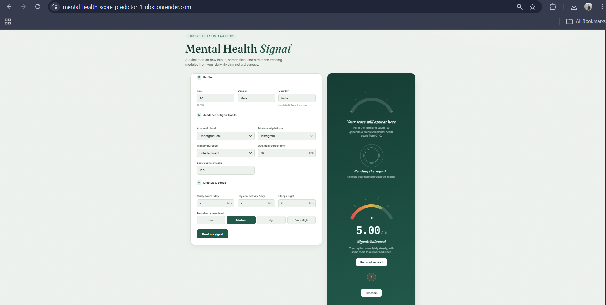

# 🧠 Mental Health Score Predictor

<p align="center">
  <strong>An end-to-end machine learning web application for estimating a student's mental health score from lifestyle, academic, and digital-habit inputs.</strong>
</p>

<p align="center">
  <a href="https://mental-health-score-predictor-1-obki.onrender.com/">
    
  </a>
  <a href="https://github.com/ronak-dev01/Mental_Health_Score_Predictor">
    
  </a>
</p>

<p align="center">
  
  
  
  
</p>

---

## 🌐 Live Project

### 👉 [Open the Live Mental Health Score Predictor](https://mental-health-score-predictor-1-obki.onrender.com/)

The application is deployed and provides an interactive web interface where users can enter student profile, academic, digital-usage, lifestyle, and stress information and receive a predicted **mental health score from 0–10**.

> **Important:** This project is intended for informational and educational purposes only. It is **not a clinical diagnostic tool** and should not be used as a substitute for professional mental-health assessment or medical advice.

---

## 📸 Application Preview



*Interactive student wellness prediction interface.*

---

## ✨ What This Project Does

**Mental Health Score Predictor** is an end-to-end machine learning project that connects a trained predictive model with a modern web interface.

The user provides information such as:

- 👤 Age and gender
- 🌍 Country
- 🎓 Academic level
- 📱 Most-used social/digital platform
- 🎯 Primary purpose of platform usage
- ⏱️ Average daily screen time
- 🔓 Daily phone unlocks
- 📚 Study hours
- 🏃 Physical activity
- 😴 Sleep duration
- 🧠 Perceived stress level

The backend validates these inputs, prepares them in the same feature structure used during model training, passes them to the saved machine-learning pipeline, and returns the predicted score.

---

## 🧩 Key Features

| Feature | Description |
|---|---|
| 🧠 **ML Prediction** | Predicts a mental health score using a trained Scikit-learn model |
| 🌐 **Web Interface** | Clean HTML/CSS/JavaScript frontend |
| ⚡ **FastAPI Backend** | Lightweight REST API for prediction |
| ✅ **Input Validation** | Pydantic models validate incoming data |
| 🔐 **CORS Support** | Configured for frontend-to-API communication |
| 📊 **Structured Prediction** | Returns a numerical score rounded to two decimal places |
| ☁️ **Cloud Deployment** | Deployed and accessible through Render |
| 📦 **Serialized Model** | Trained model stored as `Mental_Health_Model.pkl` |

---

## 🏗️ System Architecture

```text
┌───────────────────────────────┐
│         User / Browser        │
└───────────────┬───────────────┘
                │
                ▼
┌───────────────────────────────┐
│     HTML + CSS + JavaScript   │
│         Frontend UI           │
└───────────────┬───────────────┘
                │
                │  POST /predict
                ▼
┌───────────────────────────────┐
│          FastAPI API          │
│      Pydantic Validation      │
└───────────────┬───────────────┘
                │
                ▼
┌───────────────────────────────┐
│   Mental_Health_Model.pkl     │
│      Scikit-learn Model       │
└───────────────┬───────────────┘
                │
                ▼
┌───────────────────────────────┐
│   Predicted Mental Health     │
│          Score (0–10)         │
└───────────────────────────────┘
```

---

## 🛠️ Tech Stack

### Frontend
- HTML5
- CSS3
- JavaScript

### Backend
- Python
- FastAPI
- Pydantic
- Uvicorn
- CORS Middleware

### Machine Learning
- Scikit-learn
- Pandas
- NumPy
- Joblib

### Deployment
- Render

---

## 📂 Project Structure

```text
Mental_Health_Score_Predictor/
│
├── Mental_Health_Model.pkl
├── Model.ipynb
├── Student Social Media And Mental Health Impact.csv
│
├── index.html
├── style.css
├── script.js
│
├── main.py
├── requirements.txt
│
└── README.md
```

---

## 🔄 How Prediction Works

1. The user fills out the web form.
2. JavaScript collects the entered values.
3. The frontend sends the data to the FastAPI `/predict` endpoint.
4. Pydantic validates the request.
5. The backend converts the request into the feature format expected by the model.
6. The saved Scikit-learn model generates a prediction.
7. FastAPI returns the predicted score as JSON.
8. The frontend displays the result to the user.

---

## 🔌 API

### `POST /predict`

The prediction endpoint accepts student information and returns the predicted mental health score.

### Response

```json
{
  "predicted_mental_health_score": 5.42
}
```

### Root endpoint

```http
GET /
```

Returns a simple API welcome response.

---

## 🚀 Run Locally

### 1. Clone the repository

```bash
git clone https://github.com/ronak-dev01/Mental_Health_Score_Predictor.git
cd Mental_Health_Score_Predictor
```

### 2. Create a virtual environment

```bash
python -m venv .venv
```

### 3. Activate it

**Windows:**

```powershell
.venv\Scripts\activate
```

**macOS/Linux:**

```bash
source .venv/bin/activate
```

### 4. Install dependencies

```bash
pip install -r requirements.txt
```

### 5. Start FastAPI

```bash
uvicorn main:app --reload
```

The API will be available at:

```text
http://127.0.0.1:8000
```

FastAPI's interactive documentation will be available at:

```text
http://127.0.0.1:8000/docs
```

---

## 📈 Model & Data

The project uses a serialized machine-learning model stored in:

```text
Mental_Health_Model.pkl
```

The backend loads this model with Joblib and uses it to generate predictions from the submitted student features.

The repository also includes the dataset used for the project:

```text
Student Social Media And Mental Health Impact.csv
```

and the modelling notebook:

```text
Model.ipynb
```

---

## 🎯 Why This Project?

Students' mental well-being can be influenced by multiple aspects of everyday life, including:

- Digital habits
- Academic workload
- Sleep
- Physical activity
- Perceived stress
- Social-media/platform usage

This project demonstrates how these factors can be combined with machine learning to create an accessible predictive application.

It is primarily an **educational machine-learning and deployment project**, demonstrating the complete workflow from dataset and model development to API creation, frontend integration, and cloud deployment.

---

## 🔮 Future Improvements

- [ ] Add model performance metrics to the application
- [ ] Add prediction confidence/uncertainty information
- [ ] Add historical prediction tracking
- [ ] Add visual analytics for lifestyle factors
- [ ] Add automated model monitoring
- [ ] Add unit and API tests
- [ ] Add Docker-based deployment
- [ ] Improve accessibility and mobile responsiveness
- [ ] Add a dedicated mental-health resources section

---

## ⚠️ Disclaimer

This application provides a machine-learning-based estimate for **educational and informational purposes only**.

A predicted score does **not** represent a medical diagnosis, psychological assessment, or professional clinical opinion.

If you are experiencing mental-health difficulties or are concerned about your well-being, please consult a qualified mental-health professional or an appropriate local support service.

---

## 👨‍💻 Author

**Ronak Bhardwaj**

- GitHub: [@ronak-dev01](https://github.com/ronak-dev01)
- Project: [Mental Health Score Predictor](https://github.com/ronak-dev01/Mental_Health_Score_Predictor)
- Live Demo: [mental-health-score-predictor-1-obki.onrender.com](https://mental-health-score-predictor-1-obki.onrender.com/)

---

## ⭐ Support

If you find this project useful or interesting, consider giving the repository a ⭐ on GitHub.

<p align="center">
  <strong>Built with Python • FastAPI • Scikit-learn • HTML • CSS • JavaScript • Render</strong>
</p>
